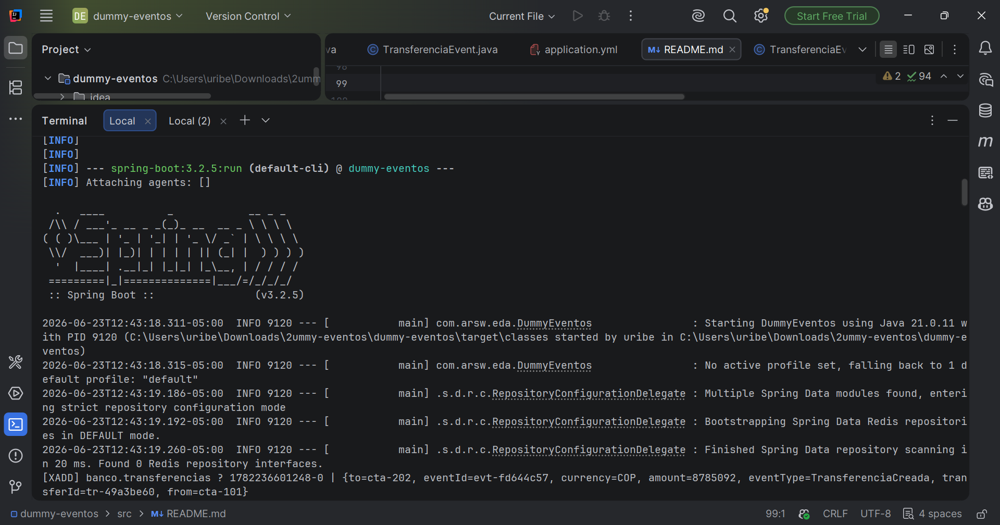
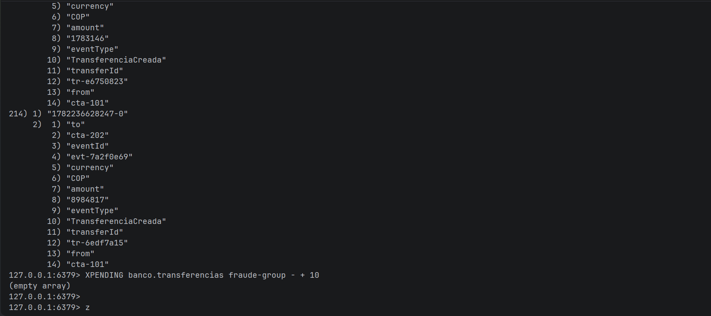

# Dummy Generador de Eventos - EDA con Redis Streams
**ARSW 2026i**

---

## ¿Qué es esto?

Implementación de la actividad sugerida en la presentación *Arquitecturas orientadas por eventos (EDA + Redis)*:

> *"Agregar un tercer consumidor auditoria-group que guarde cada TransferenciaCreada y simular la caída de un consumidor antes del XACK."*

Como primer paso, este proyecto implementa el **productor de eventos (dummy)** que genera eventos `TransferenciaCreada` y los publica en un stream de Redis cada 3 segundos.

---

## ¿Por qué Redis Streams?

La presentación establece que para arquitecturas orientadas por eventos de negocio, Redis Streams es la opción recomendada sobre Pub/Sub simple porque:

- **Persiste los eventos** — si un consumidor no está conectado, el evento sigue disponible
- **Asigna IDs únicos** a cada mensaje para trazabilidad
- **Soporta grupos de consumidores** con confirmación (XACK)
- **Permite reprocesar** eventos ante fallos

---

## Estructura del proyecto

dummy-eventos/

├── pom.xml

└── src/main/java/com/arsw/eda/

├── DummyEventos.java       ← Arranque Spring Boot

└── Transferencia.java   ← Dummy productor de eventos

---

## ¿Cómo funciona?

El dummy simula ser un sistema bancario que genera transferencias. Cada 3 segundos ejecuta el equivalente a lo visto en clase:

```bash
XADD banco.transferencias * eventType TransferenciaCreada \
    eventId evt-1001 transferId tr-987 amount 150000 currency COP
```

### Campos del evento

| Campo | Descripción |
|-------|-------------|
| `eventType` | Nombre del evento en pasado: `TransferenciaCreada` |
| `eventId` | ID único para idempotencia |
| `transferId` | ID de la transferencia de negocio |
| `from` | Cuenta origen |
| `to` | Cuenta destino |
| `amount` | Monto en COP |
| `currency` | Moneda: COP |

---

## Cómo correrlo

### 1. Levantar Redis con Docker

```bash
docker run --name redis-eda -p 6379:6379 -d redis:7
```

### 2. Correr el proyecto

```bash
mvn spring-boot:run
```

### 3. Verificar eventos en Redis

```bash
docker exec -it redis-eda redis-cli
XRANGE banco.transferencias - +
```

---

## Atributos de calidad demostrados

| Atributo | Cómo se demuestra |
|----------|-------------------|
| **Disponibilidad** | Los eventos persisten en Redis aunque no haya consumidores activos |
| **Desempeño** | Procesamiento asíncrono con `@Scheduled` sin bloquear el hilo principal |
| **Modificabilidad** | Cambiar la frecuencia o los campos del evento no afecta a Redis |

---

## Evidencia




---

## Referencias

- Presentación: *Arquitecturas orientadas por eventos (EDA + Redis)*
- Presentación: *Atributos de Calidad del Software*